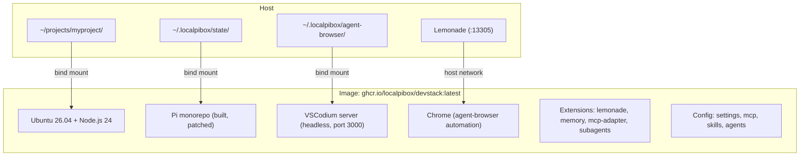
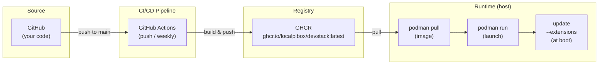
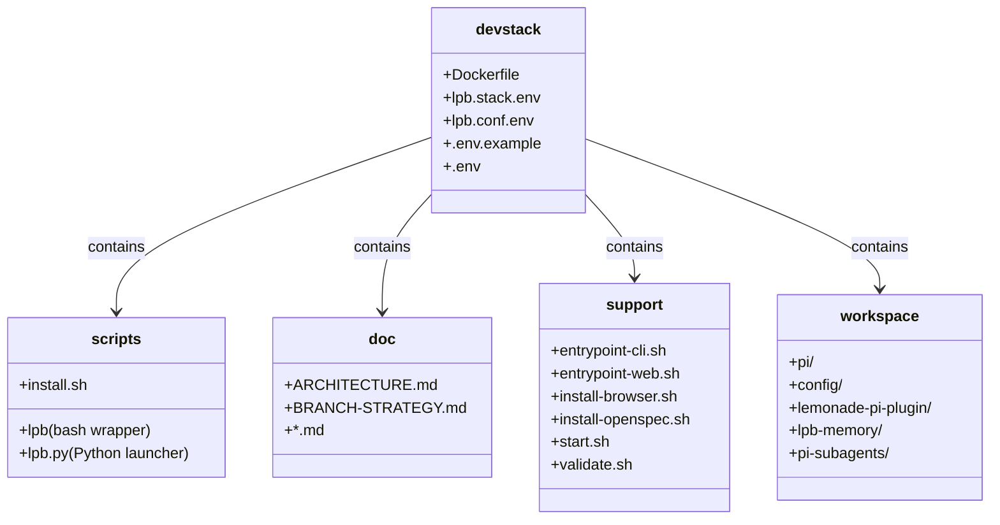

# LocalPibox Devstack

AI-powered development environment with the Pi coding agent, VSCodium editor, and agent-browser automation — all containerized.

## Quick Start

### Option 1: One-line installer (recommended)

```bash
# Install the `lpb` launcher (adds it to ~/.local/bin/)
curl -fsSL https://raw.githubusercontent.com/localpibox/devstack/main/scripts/install.sh | bash

# Run devstack for your project
lpb /path/to/your/project

# Or start VSCodium with a welcome screen (user picks project)
lpb

# Common commands
lpb --stop      # Stop the container
lpb --logs      # View logs
lpb --remove    # Remove everything
lpb --config    # Show config file
lpb --help      # Full usage
```

### Option 2: Manual podman run

```bash
# Pull the latest image
podman pull ghcr.io/localpibox/devstack:latest

# Run with a project folder
podman run -d --name localpibox --network host --userns keep-id \
    -v /path/to/your/project:/home/lpb/workspace/myproject:Z \
    -v ~/.localpibox/state:/home/lpb/.pi:Z \
    -v ~/.localpibox/agent-browser:/home/lpb/.agent-browser:Z \
    -e ED_PORT=3000 \
    ghcr.io/localpibox/devstack:latest

# Open browser to http://localhost:3000 (token: devsession)
```

### Interactive mode

```bash
# Run and get a shell inside the container
podman run -it --name localpibox --network host --userns keep-id \
    -v /path/to/your/project:/home/lpb/workspace/myproject:Z \
    -v ~/.localpibox/state:/home/lpb/.pi:Z \
    -v ~/.localpibox/agent-browser:/home/lpb/.agent-browser:Z \
    -e ED_PORT=3000 \
    ghcr.io/localpibox/devstack:latest
```

### Update extensions (no rebuild)

```bash
# Inside the running container
podman exec -it localpibox update --extensions
```

## Architecture



Mount structure:
- Host: `$PROJECT → /home/lpb/workspace/myproject/`
- Host: `~/.localpibox/state → /home/lpb/.pi` (persistent agent state)
- Host: `~/.localpibox/agent-browser → /home/lpb/.agent-browser` (browser sessions)
- Host: `Lemonade (:13305) → 127.0.0.1:13305` (host network mode)

## Commands Available Inside Container

Once the container is running, these commands are available:

| Command | Description |
|---|---|
| `pi` | Start Pi CLI |
| `update --extensions` | Update extensions to latest |
| `update --patches` | Apply Pi source patches |
| `exit` | Stop the server and exit |

### Update examples

```bash
# Update extensions to latest release
podman exec -it localpibox update --extensions

# Patches are baked into the image — to update, rebuild the container
# with updated fork branches in lpb.stack.env.
```

## Usage

### Single project

```bash
# Run with any project folder
podman run -d --name localpibox --network host --userns keep-id \
    -v /home/user/projects/myproject:/home/lpb/workspace/myproject:Z \
    -v ~/.localpibox/state:/home/lpb/.pi:Z \
    -v ~/.localpibox/agent-browser:/home/lpb/.agent-browser:Z \
    ghcr.io/localpibox/devstack:latest
```

The project mounts at `/workspace/myproject/` so tools see the correct project name (not "workspace").

### Multiple projects

```bash
# First project
podman run -d --name localpibox --network host --userns keep-id \
    -e ED_PORT=3000 \
    -v /path/to/project-a:/home/lpb/workspace/project-a:Z \
    -v ~/.localpibox/state:/home/lpb/.pi:Z \
    -v ~/.localpibox/agent-browser:/home/lpb/.agent-browser:Z \
    ghcr.io/localpibox/devstack:latest
# → http://localhost:3000

# Stop and run another
podman stop localpibox
podman rm localpibox

podman run -d --name localpibox --network host --userns keep-id \
    -e ED_PORT=3001 \
    -v /path/to/project-b:/home/lpb/workspace/project-b:Z \
    -v ~/.localpibox/state:/home/lpb/.pi:Z \
    -v ~/.localpibox/agent-browser:/home/lpb/.agent-browser:Z \
    ghcr.io/localpibox/devstack:latest
# → http://localhost:3001
```

## Update Flow



**What gets updated:**

| Component | How | Frequency |
|---|---|---|

| Component | How | Frequency |
|---|---|---|
| Base image | CI/CD on push to main | Every code change |
| Extensions | `pi update --extensions` (at boot) | Every container start |
| Chrome/VSCodium | Base image rebuild | Monthly or on-demand |
| lpb launcher | `lpb --update` self-update | Every code change |

**Note:** Pulls may take a while on slow connections — `lpb --update` uses
non-blocking streaming so you'll see real-time progress (no timeouts).

## Forked Repos, Patches & Upstream Policy

Fork URLs and branches are tracked in `lpb.stack.env` at the repo root. Each
LocalPibox fork carries its localpibox work as a **single squashed commit** on
top of upstream (or as its own root commit for independent projects), so the
delta vs upstream is always one clean patch.

| Repo | Upstream | Upstream latest | LocalPibox work | Update policy |
|---|---|---|---|---|
| **pi** | `earendil-works/pi` | release **v0.83.0** | Qwen reasoning + context-overflow patches | rebase `lpb` patch onto upstream **on releases** only |
| **lemonade-pi-plugin** | `lemonade-sdk/lemonade-pi-plugin` | **no stable release** | Qwen thinking + vision support | follow upstream **main**; check periodically |
| **pi-subagents** | `tintinweb/pi-subagents` | release **v0.14.3** | centralized subagent model registry | branch & follow **master** releases; submit upstream if clean |
| **lpb-memory** | *(independent — full refactor)* | — | Pi memory extension (subprocess provider) | no upstream to track |
| **config** | — | — | preset: settings, skills, agents | own |
| **devstack** | — | — | this stack | own |

### `pi` → `earendil-works/pi` (releases)

One squashed patch commit on `lpb` (`packages/ai`, `packages/agent`, …):

| Patch | What it does | File |
|---|---|---|
| `reasoning_effort` | Send `reasoning_effort` (high/medium/low) for Qwen models via the `qwen` / `qwen-chat-template` thinking formats | `packages/ai/src/api/openai-completions.ts` |
| `reasoning_budget_tokens` | Add reasoning-budget token support/typing for Qwen to prevent runaway thinking | `packages/ai/src/types.ts`, `generate-models.ts`, ai tests |
| Case 4 context overflow | Add Case 4 to `isContextOverflow`: Qwen/Llama.cpp reasoning overflow (`stopReason=length` + `output>0` + input ≥ 90% window) | `packages/ai/src/utils/overflow.ts` |
| compaction tuning | Adjust compaction for Qwen thinking windows | `packages/agent/src/harness/compaction/compaction.ts` |
| reasoning wiring | `reasoning_effort` field plumbing in coding-agent config | `packages/coding-agent/src/config.ts` |

Update: rebase the patch onto the **next upstream release** (after v0.83.0).

### `lemonade-pi-plugin` → `lemonade-sdk/lemonade-pi-plugin` (main)

One squashed patch commit on `lpb` (`extensions/index.ts`, `+287/-49`): API-key
auth type registration, Qwen thinking-format support (`thinkingLevelMap`),
vision-capability detection, and reasoning-format handling. Update policy: no
stable release upstream yet — **check periodically** and rebase onto upstream
`main`.

### `pi-subagents` → `tintinweb/pi-subagents` (master)

One squashed patch commit on `master` (`src/index.ts`, `src/settings.ts`,
`src/agent-runner.ts`, `src/default-agents.ts`): a **centralized subagent model
registry** (remove Anthropic-heavy defaults; make all subagents inherit the
session model), plus removal of a workflow file (OAuth scope limitation). If
this patch proves clean and generally useful, **submit it upstream**.

### `lpb-memory` — independent

Original Hermes base was **fully refactored** and is now an independent project
(no upstream to track). Provides the Pi memory extension: subprocess-based
background reviews, model-override propagation, memory store + handlers.

### Upstreaming policy

Patches are **candidate upstream contributions**: they go upstream only if
generally useful and not too opinionated for this stack's specific
configuration. Local-workaround-specific patches or ones that diverge from
upstream design direction stay on the LocalPibox fork branch.

## Forking & Repointing

You can fork this repo, personalize it, and repoint it at your own managed
set of repositories (Pi core, config preset, and extensions) instead of the
LocalPibox originals.

### What each component maps to

| Component | URL / ref lives in | Effort | Repoint path |
|---|---|---|---|
| **Extensions** (lemonade-pi-plugin, lpb-memory, pi-subagents, …) | runtime config `~/.pi/agent/settings.json` → `packages` | 🟢 trivial, **no rebuild** | edit the `packages` array, or `pi install git:<fork>/<repo>`; applied at next startup via `pi update --extensions` |
| **Config preset** (localpibox/config) | `lpb.stack.env` → `LPB_CONFIG_FORK` / `LPB_CONFIG_REF` | 🟡 one rebuild, or no rebuild at runtime | rebuild `--build-arg CONFIG_FORK=...`, **or** `git -C ~/.pi/agent/ remote set-url origin <fork>` (no rebuild) |
| **Pi core** (localpibox/pi) | `lpb.stack.env` → `LPB_PI_FORK` / `LPB_PI_REF` | 🔴 image rebuild | fork `localpibox/pi`, set engine + `LPB_IMAGE_CLI`, rebuild |

### Full repoint procedure (image build)

1. Fork the repos you care about (e.g. `localpibox/pi`, `localpibox/config`).
2. Clone **this** repo (devstack) and edit `lpb.stack.env` at the root to point
   at your forks:

   ```sh
   export LPB_PI_FORK=https://github.com/<you>/pi.git
   export LPB_PI_REF=main                 # your branch
   export LPB_CONFIG_FORK=https://github.com/<you>/config.git
   export LPB_CONFIG_REF=main             # your branch
   export LPB_IMAGE_CLI=ghcr.io/<you>/devstack:cli
   export LPB_IMAGE_WEB=ghcr.io/<you>/devstack:web
   export LPB_CONTAINER_NAME=mybox        # avoid colliding with localpibox
   ```

   (Or pass them as `docker build --build-arg PI_FORK=... --build-arg
   CONFIG_FORK=...` without editing the file.)
3. Build and push the image (locally, or via the GitHub Actions workflow,
   which reads `lpb.stack.env`).
4. Install/run `lpb` — it reads the same `lpb.stack.env` for image/container
   names, so it picks up your fork automatically.
5. Point the launcher at your image
   `~/.localpibox/devstack/config` → `export
   LPB_IMAGE_NAME="ghcr.io/<you>/devstack:latest"`, or let the forked
   `lpb` handle it.

### Repointing the config preset without a rebuild

The config preset is a git clone at `~/.pi/agent/` (container). After
first boot you can repoint it live — no image rebuild needed:

```sh
podman exec -it localpibox bash
cd ~/.pi/agent/
git remote set-url origin https://github.com/<you>/config.git
git pull --ff-only origin <your-branch>
# re-seed the runtime copy from your preset
# Config repo IS ~/.pi/ — managed by start.sh at container startup
```

### Repointing extensions at runtime (no rebuild)

Extensions are not baked in; they are installed on first boot from
`settings.json#packages`. Repoint them from the running container:

```sh
podman exec -it localpibox pi remove git:github.com/localpibox/lemonade-pi-plugin
podman exec -it localpibox pi install git:github.com/<you>/lemonade-pi-plugin@<your-branch>
podman exec -it localpibox pi update --extensions
```

Changes apply at the **next pi startup** (or `/reload` in a running session
for config).

## CI/CD

Built automatically on GitHub Actions when:
- Push to `main` (Dockerfile, support/, lpb.stack.env)
- Weekly (Monday 3am UTC) — keeps image fresh
- Manual dispatch with flags

### Actions used (all latest versions, Node.js 24 native)

- `actions/checkout@v6`
- `docker/build-push-action@v7`
- `docker/setup-buildx-action@v4`
- `docker/setup-qemu-action@v4`
- `docker/login-action@v4`
- `docker/metadata-action@v6`
- `actions/upload-artifact@v7`

## Troubleshooting

### Port already in use

```bash
# Check who's using the port
lsof -i :3000

# Stop existing container
podman stop localpibox
podman rm localpibox

# Run with new port
podman run -d --name localpibox --network host --userns keep-id \
    -e ED_PORT=8080 \
    -v /path/to/project:/home/lpb/workspace/myproject:Z \
    -v ~/.localpibox/state:/home/lpb/.pi:Z \
    -v ~/.localpibox/agent-browser:/home/lpb/.agent-browser:Z \
    ghcr.io/localpibox/devstack:latest
# → http://localhost:8080
```

### Auth token expired

```bash
# Login in the editor (Ctrl+Shift+P → "Pi: Login")
# Or via CLI
podman exec -it localpibox pi login
```

### Outdated extensions

```bash
podman exec -it localpibox update --extensions
```

### Need a rebuild

```bash
# Pull from GHCR (newer build)
podman pull ghcr.io/localpibox/devstack:latest
podman stop localpibox && podman rm localpibox
podman run -d --name localpibox --network host --userns keep-id \
    -v /path/to/project:/home/lpb/workspace/myproject:Z \
    -v ~/.localpibox/state:/home/lpb/.pi:Z \
    -v ~/.localpibox/agent-browser:/home/lpb/.agent-browser:Z \
    ghcr.io/localpibox/devstack:latest
```

## Directory Structure



## Related Repositories

- [localpibox/pi](https://github.com/localpibox/pi) — Forked Pi monorepo with Qwen reasoning support
- [localpibox/lemonade-pi-plugin](https://github.com/localpibox/lemonade-pi-plugin) — Lemonade provider plugin
- [localpibox/config](https://github.com/localpibox/config) — Pi configuration (settings, mcp, skills)
- [localpibox/lpb-memory](https://github.com/localpibox/lpb-memory) — Persistent memory + session search extension
- [localpibox/localpibox](https://github.com/localpibox/localpibox) — Project overview & stack reference
- [localpibox/localpibox.github.io](https://github.com/localpibox/localpibox.github.io) — Project site (GitHub Pages)
